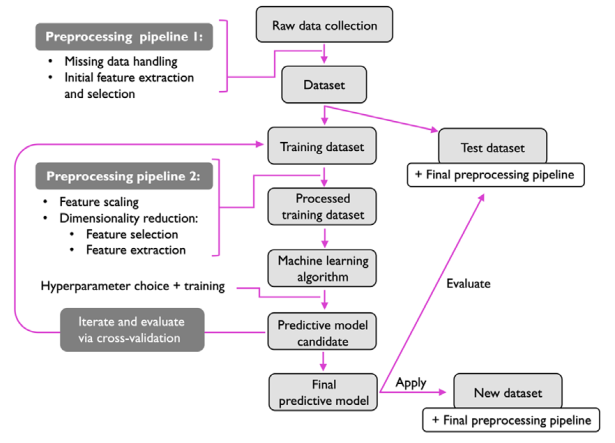

### Table of Contents
- [Giving Computers the Ability to Learn from Data](#giving-computers-the-ability-to-learn-from-data)
  - [Building intelligent machines to transform data into knowledge](#building-intelligent-machines-to-transform-data-into-knowledge)
  - [The three different types of machine learning](#the-three-different-types-of-machine-learning)
    - [Making predictions about the future with Supervised Learning](#making-predictions-about-the-future-with-supervised-learning)
    - [Solving interactive problems with reinforcement learning](#solving-interactive-problems-with-reinforcement-learning)
    - [Discovering hidden structures with unsupervised learning](#discovering-hidden-structures-with-unsupervised-learning)
    - [In Short:](#in-short)
  - [Introduction to the basic terminology and notations](#introduction-to-the-basic-terminology-and-notations)
    - [Notation](#notation)
    - [Terminology](#terminology)
  - [A Roadmap for Building Machine Learning Systems](#a-roadmap-for-building-machine-learning-systems)
    - [Preprocessing – getting data into shape](#preprocessing--getting-data-into-shape)
    - [Training and selecting a predictive model](#training-and-selecting-a-predictive-model)
    - [Evaluating models and predicting unseen data instances](#evaluating-models-and-predicting-unseen-data-instances)
  - [Summary](#summary)

---

# Giving Computers the Ability to Learn from Data

- **Machine Learning (ML) Definition**:  
  - The application and science of algorithms that make sense of data.  
  - Aims to turn data into knowledge using self-learning algorithms.  
  - ML transforms data into actionable insights.  

- **Why ML is Exciting**:  
  - We live in an age of abundant data, making ML highly relevant and impactful.  
  - ML is considered the most exciting field in computer science based on author's opinion.  

- **Opportunities in ML**:  
  - Open-source libraries have made ML more accessible than ever.  
  - Ideal time to learn and apply ML algorithms to spot patterns and make predictions.  
  - Open-source tools have democratized access to ML.  

- **Chapter Focus**:  
  - Introduces **main concepts** and **different types of machine learning**.  
  - Provides a **basic introduction to key terminology**.  
  - Lays the groundwork for using ML techniques for **practical problem-solving**.  

## Building intelligent machines to transform data into knowledge

- **Abundance of Data**:  
  - Modern technology has led to an abundance of **structured and unstructured data**.  
  - Machine learning (ML) evolved in the late 20th century as a subfield of **artificial intelligence (AI)**.  
  - ML involves **self-learning algorithms** that derive knowledge from data to make predictions.  

- **Purpose of Machine Learning**:  
  - Provides an efficient alternative to manual rule derivation and model building.  
  - Captures knowledge from data to improve predictive models and enable **data-driven decisions**.  

- **Importance of ML**:  
  - Increasingly critical in **computer science research** and **everyday life**.  
  - Powers applications like:  
    - Email spam filters.  
    - Text and voice recognition software.  
    - Web search engines.  
    - Movie recommendations.  
    - Mobile check deposits.  
    - Meal delivery time estimates.  
  - Future potential: **safe and efficient self-driving cars**.  

- **Breakthroughs in ML Applications**:  
  - **Healthcare**:  
    - Deep learning models detect **skin cancer** with near-human accuracy.  
    - DeepMind’s deep learning models predict **3D protein structures**, outperforming traditional physics-based approaches.  
    - Systems predict **oxygen needs of COVID-19 patients** to optimize hospital resource allocation.  
  - **Climate Change**:  
    - Intelligent systems are being developed to combat climate change.  
    - **Precision agriculture**:  
      - Uses computer vision and ML to optimize resource deployment.  
      - Aims to minimize fertilizer use and waste.  

- **Key Takeaways**:  
  - ML transforms data into actionable insights, driving innovation across industries.  
  - Breakthroughs in healthcare, climate change, and everyday applications highlight ML’s transformative potential.  
  - ML continues to address some of the most critical challenges of our time.

## The three different types of machine learning

Let's take a look at the three types of machine learning: **supervised learning**, **unsupervised learning**, and **reinforcement learning**.

### Making predictions about the future with Supervised Learning

- **Goal of Supervised Learning**:  
  - Learn a model from **labeled training data** to make predictions about **unseen or future data**.  

- **Definition of "Supervised"**:  
  - Refers to training examples where **data inputs** and their corresponding **desired outputs (labels)** are known.  
  - The process involves modeling the relationship between inputs and labels.  
  - Also referred to as **"label learning."**  

- **Supervised Learning Workflow**:  
  1. **Labeled training data** is provided as input.  
  2. A **machine learning algorithm** fits a predictive model.  
  3. The model makes predictions on **new, unlabeled data**.  

- **Example: Email Spam Filtering**:  
  - Train a model using labeled emails (spam or non-spam).  
  - Predict whether a new email is spam or not.  

- **Types of Supervised Learning Tasks**:  
  - **Classification**:  
    - A subcategory of **supervised learning**.  
    - Goal: Predict **categorical class labels** of new data points based on past observations.  
    - Class labels are **discrete, unordered values** representing group memberships.  

    - **Binary Classification**:  
      - Example: **Email spam detection**.  
      - Two classes: **spam** and **non-spam**.  
      - Algorithm learns rules to distinguish between the two classes.  

    - **Example: Binary Classification Task**:  
      - Dataset: 30 training examples (15 labeled as **Class A**, 15 as **Class B**).  
      - Two-dimensional data: Each example has values **x1** and **x2**.  
      - Algorithm learns a **decision boundary** (dashed line) to separate classes and classify new data.  

    - **Multiclass Classification**:  
      - Not limited to binary classes; can predict **multiple class labels**.  
      - Example: **Handwritten character recognition**.  
        - Training dataset includes multiple examples of each letter in the alphabet.  
        - Class labels: Letters (“A,” “B,” “C,” etc.).  
        - Model predicts the correct letter for new handwritten input.  

    - **Limitations of Classification**:  
      - Model can only predict class labels present in the training dataset.  
      - Example: A model trained on letters cannot recognize digits (0–9) if they were not part of the training data.  
        
    ---

  - **Regression**:  
    - A type of **supervised learning** where the goal is to predict **continuous outcomes**.  
    - Also known as **regression analysis**.  
    - Involves finding a relationship between **predictor variables (features)** and a **continuous response variable (target)**.  

    - **Terminology**:  
      - **Predictor variables**: Commonly called **features**.  
      - **Response variable**: Commonly called **target variable**.  

    - **Example: Predicting Math SAT Scores**:  
      - Predictor: **Time spent studying**.  
      - Target: **Math SAT score**.  
      - Goal: Learn a model to predict scores based on study time for future students.  

    - **Historical Context**:  
      - Term “regression” coined by **Francis Galton** in 1886.  
      - Described the phenomenon of **regression toward the mean** in hereditary stature.  
      - Observed that children’s height regresses toward the population mean rather than matching parents’ height exactly.  

    - **Linear Regression**:  
      - Fits a **straight line** to the data to model the relationship between a feature (**x**) and a target (**y**).  
      - Minimizes the **average squared distance** between data points and the fitted line.  
      - Uses the **intercept** and **slope** of the line to predict target variables for new data.  

    - **Key Takeaways**:  
      - Regression predicts continuous outcomes based on input features.  
      - Linear regression is a common method for modeling relationships between variables.  
      - The concept of regression originated from observations in biology and statistics.  

---

### Solving interactive problems with reinforcement learning

- **Definition of Reinforcement Learning**:  
  - A type of machine learning where an **agent** improves its performance through **interactions with the environment**.  
  - The agent receives **reward signals** based on its actions, which guide its learning process.  

- **Key Components**:  
  - **Agent**: The system that learns and makes decisions.  
  - **Environment**: The context in which the agent operates.  
  - **Reward Signal**: Feedback that measures the success of an action.  

- **Comparison to Supervised Learning**:  
  - Similar to supervised learning in that it uses feedback.  
  - However, the feedback is not a **ground truth label** but a **reward** based on the action’s success.  

- **Learning Process**:  
  - The agent learns a **series of actions** that **maximize the reward**.  
  - Uses **exploratory trial-and-error** or **deliberative planning** to achieve this.  

- **Example: Chess Program**:  
  - **Agent**: Chess program.  
  - **Environment**: Chessboard and game state.  
  - **Reward**: Winning or losing the game.  
  - The agent learns to make moves that increase the likelihood of winning.  

- **States and Rewards**:  
  - Each **state** of the environment can be associated with a **positive or negative reward**.  
  - Rewards can be **immediate** or **delayed** (e.g., winning or losing at the end of a game).  

- **Chess Example**:  
  - Certain board configurations (states) are more likely to lead to winning (e.g., capturing an opponent’s piece).  
  - Other configurations may lead to losing (e.g., losing a piece to the opponent).  
  - The final reward depends on the **opponent’s actions** and the game’s outcome.  

- **Goal of Reinforcement Learning**:  
  - To learn a **sequence of actions** that **maximizes the total reward**.  
  - Rewards can be earned **immediately** or through **delayed feedback**.  

---

### Discovering hidden structures with unsupervised learning

- **Definition of Unsupervised Learning**:  
  - Deals with **unlabeled data** or data of **unknown structure**.  
  - Goal: Explore the data’s structure to extract meaningful information **without guidance** from known outcomes or rewards.  

- **Key Characteristics**:  
  - No predefined labels or target variables.  
  - No reward function as in reinforcement learning.  
  - Focuses on **discovering hidden patterns** or structures in data.  
  
  ---
- **Clustering**  
  - **Definition**:  
    - An **exploratory data analysis** technique used to organize data into **subgroups (clusters)**.  
    - No prior knowledge of group memberships is required.  

  - **Purpose**:  
    - Groups objects based on **similarity** within clusters and **dissimilarity** between clusters.  
    - Also called **unsupervised classification**.  

  - **Applications**:  
    - **Marketing**: Discover customer groups based on interests for targeted marketing.  
    - **Biology**: Group genes with similar expression patterns.  
    - **Image Segmentation**: Group pixels with similar colors or textures.  

  - **Example**:  
    - Organize unlabeled data into **three clusters (A, B, C)** based on feature similarity (e.g., **x1** and **x2**).  

  ---

- **Dimensionality Reduction**  
  - **Definition**:  
    - A subfield of unsupervised learning used to **compress high-dimensional data** into a lower-dimensional subspace.  
    - Retains **most relevant information** while removing noise.  

  - **Purpose**:  
    - Addresses challenges like **storage limitations** and **computational performance**.  
    - Improves the predictive performance of machine learning algorithms by **reducing noise**.  

  - **Applications**:  
    - **Data Compression**: Reduce storage requirements.  
    - **Visualization**: Project high-dimensional data into 2D or 3D for visualization (e.g., scatterplots, histograms).  
    - **Feature Preprocessing**: Prepare data for machine learning algorithms.  

  - **Example**:  
    - Compress a **3D Swiss roll** dataset into a **2D feature subspace** using nonlinear dimensionality reduction.  

---

### In Short:
1. **Supervised Learning**:
   - **Labeled data**: The data used for training includes input-output pairs.
   - **Direct feedback**: The model receives immediate feedback on its predictions.
   - **Predict outcome/future**: The goal is to predict outcomes or future events based on the input data.

2. **Unsupervised Learning**:
   - **No labels/targets**: The data used for training does not include labeled responses.
   - **No feedback**: The model does not receive feedback on its predictions.
   - **Find hidden structure in data**: The goal is to identify underlying patterns or structures in the data.

3. **Reinforcement Learning**:
   - **Decision process**: The model learns to make a sequence of decisions.
   - **Reward system**: The model receives rewards or penalties based on its actions.
   - **Learn series of actions**: The goal is to learn a series of actions that maximize the cumulative reward.

---

## Introduction to the basic terminology and notations

### Notation

- **Iris Dataset Overview**:  
  - A classic dataset in machine learning.  
  - Contains measurements of **150 Iris flowers** from **3 species**:  
    - **Setosa**, **Versicolor**, and **Virginica**.  
  - Each flower is represented as a **row** in the dataset.  
  - Measurements (in centimeters) are stored as **columns (features)**.  

- **Dataset Structure**:  
  - **Rows**: Represent individual flower examples.  
  - **Columns**: Represent features (e.g., sepal length, sepal width, petal length, petal width).  

- **General Notation**:  
  - **Superscript (i)**: Refers to the **ith training example**.  
  - **Subscript (j)**: Refers to the **jth dimension** of the training dataset.  

- **Matrix Notation**:  
  - The dataset is represented as a **150×4 matrix**, denoted as $\boldsymbol{X} \in \mathbb{R}^{150 \times 4}$.  
  - Each row corresponds to a flower example:  
    $$
    \boldsymbol{x}^{(i)} = [x_{1}^{(i)}, x_{2}^{(i)}, x_{3}^{(i)}, x_{4}^{(i)}]
    $$  
  - Each column represents a feature across all examples:  
    $$
    \boldsymbol{x}_{j} = 
    \begin{bmatrix}
    x_{j}^{(1)} \\
    x_{j}^{(2)} \\
    \vdots \\
    x_{j}^{(150)}
    \end{bmatrix}
    $$  

- **Matrix Representation**:  
  $$
  \boldsymbol{X} = 
  \begin{bmatrix}
  x_{1}^{(1)} & x_{2}^{(1)} & x_{3}^{(1)} & x_{4}^{(1)} \\
  x_{1}^{(2)} & x_{2}^{(2)} & x_{3}^{(2)} & x_{4}^{(2)} \\
  \vdots & \vdots & \vdots & \vdots \\
  x_{1}^{(150)} & x_{2}^{(150)} & x_{3}^{(150)} & x_{4}^{(150)}
  \end{bmatrix}
  $$  

- **Vectors and Matrices**:  
  - **Vectors**: Represented with **lowercase, bold-face letters** (e.g., 𝒙).  
  - **Matrices**: Represented with **uppercase, bold-face letters** (e.g., 𝑿).  
  - **Single Elements**: Written in **italics** (e.g., $x^{(n)}$ or $x_{m}^{(n)}$).  

- **Target Variables (Class Labels)**:  
  - Represented as a **150-dimensional column vector**:  
    $$
    \boldsymbol{y} = [y^{(1)}, y^{(2)}, \dots, y^{(150)}]
    $$  
  - Each $y^{(i)}$ belongs to one of the classes: **{Setosa, Versicolor, Virginica}**.  

- **Key Takeaways**:  
  - The Iris dataset is a **tabular dataset** with 150 examples and 4 features.  
  - Matrix notation simplifies representation and manipulation of datasets in machine learning.  
  - Each row represents an **example**, and each column represents a **feature**.  
  - This structure is foundational for many machine learning algorithms.
  - Superscripts denote **training examples**, and subscripts denote **feature dimensions**.  
  - Vectors and matrices are represented with bold-face letters, while individual elements are in italics.  
  - These conventions help in clearly representing datasets, features, and target variables in machine learning.

---

### Terminology

- **Training Example**: A **row** in a dataset table; also called **observation**, **record**, **instance**, or **sample** (sample often refers to a collection of training examples).  
- **Training**: Also known as **model fitting**; in parametric models, similar to **parameter estimation**.  
- **Feature (x)**: A **column** in a dataset; also called **predictor**, **variable**, **input**, **attribute**, or **covariate**.  
- **Target (y)**: The **outcome** to be predicted; also known as **output**, **response variable**, **dependent variable**, (**class**) **label**, or **ground truth**.  
- **Loss Function**: Often synonymous with cost function or error function.  
  - "**Loss**" may refer to a **single data** point’s error.  
  - "**Cost**" may refer to the **aggregated loss** (average or sum) over the entire dataset.

---

## A Roadmap for Building Machine Learning Systems

### Preprocessing – getting data into shape

- **Preprocessing is Crucial**: Raw data is rarely in the ideal form for machine learning models.  
- **Feature Extraction**:  
  - Example: In the Iris dataset, useful features could include flower color, height, length, and width.  
- **Feature Scaling**:  
  - Many algorithms require features to be on the same scale.  
  - Common transformations:  
    - Normalize to range [0,1]  
    - Standardize to zero mean and unit variance  
- **Dimensionality Reduction**:  
  - Helps compress data onto a lower-dimensional subspace.  
  - Benefits:  
    - Reduces storage requirements.  
    - Speeds up the learning algorithm.  
    - Can improve model performance by removing irrelevant/noisy features.  
- **Train-Test Split**:  
  - The dataset is divided into:  
    - **Training set**: Used to train and optimize the model.  
    - **Test set**: Kept aside for final evaluation to ensure generalization.

---
  
### Training and selecting a predictive model

- **No Free Lunch Theorems (David Wolpert, 1996 & 1997)**:  
  - No single machine learning algorithm is best for all tasks.  
  - Every model has inherent biases and assumptions.  
  - Requires comparing multiple models to find the best-performing one.  

- **Choosing a Performance Metric**:  
  - Example: **Classification Accuracy** – the proportion of correctly classified instances.  
  - Different tasks may require different evaluation metrics.  

- **Cross-Validation**:  
  - Used to estimate model generalization without using the test set.  
  - Splits dataset into training and validation subsets.  
  - Helps prevent overfitting and ensures reliable model selection.  

- **Hyperparameter Optimization**:  
  - Hyperparameters are not learned from data but must be tuned for optimal performance.  
  - Fine-tuning hyperparameters improves model effectiveness.  
  - Essential for maximizing the performance of different machine learning algorithms.  
  
---

### Evaluating models and predicting unseen data instances

- **Model Evaluation with Test Data**:  
  - After selecting and training a model, we use the **test dataset** to estimate its performance on unseen data.  
  - This helps determine the **generalization error** (how well the model performs on new data).  

- **Using the Model for Predictions**:  
  - Once satisfied with performance, the model is used for predicting **new, future data**.  

- **Consistent Preprocessing**:  
  - Parameters for preprocessing steps (**feature scaling, dimensionality reduction, etc.**) are learned **only from the training dataset**.  
  - These same parameters are **reapplied** to the test dataset and new data to ensure consistency.  
  - Failing to do this could lead to **overly optimistic performance estimates** on test data.  

---

## Summary

In this chapter, we took a high-level look at **machine learning**, setting the stage for deeper exploration in the following chapters. We introduced the **key concepts** that form the foundation of this field and examined its two main paradigms:  

- **Supervised Learning**:  
  - **Classification**: Categorizes objects into predefined classes.  
  - **Regression**: Predicts continuous numerical values.  

- **Unsupervised Learning**:  
  - Useful for discovering hidden structures in unlabeled data.  
  - Plays a key role in **feature preprocessing** and **dimensionality reduction** for data compression.  

We also outlined the **typical machine learning workflow**, which serves as a roadmap for solving real-world problems using these techniques.  

**What’s Next?**  
Going forward, we will delve deeper into machine learning techniques, covering essential preprocessing methods to **enhance model performance**. We will explore **classification algorithms extensively**, while also learning about **regression analysis** and **clustering techniques**.  

In the next chapter, we will implement **one of the earliest classification algorithms**, laying the groundwork for Chapter 3, where we will explore a variety of machine learning models using **Scikit-Learn**, a powerful open-source library.  

---