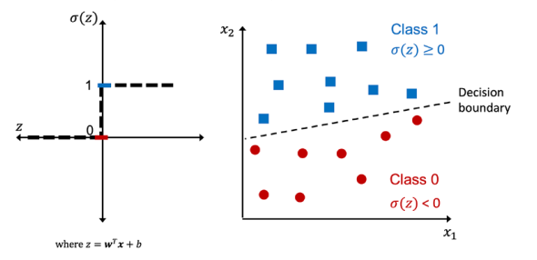
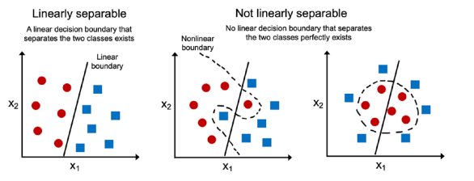
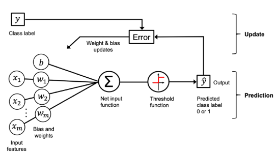

### Table of Contents
- [Training Simple Machine Learning Algorithms for Classification](#training-simple-machine-learning-algorithms-for-classification)
  - [Artificial neurons – a brief glimpse into the early history of machine learning](#artificial-neurons--a-brief-glimpse-into-the-early-history-of-machine-learning)
    - [The formal definition of an artificial neuron](#the-formal-definition-of-an-artificial-neuron)
    - [Linear Algebra Basics: Dot Product and Matrix Transpose](#linear-algebra-basics-dot-product-and-matrix-transpose)
      - [1. Notation and Definitions](#1-notation-and-definitions)
      - [2. Example of Vector Transpose](#2-example-of-vector-transpose)
      - [3. Dot Product Calculation](#3-dot-product-calculation)
      - [4. Transpose of a Matrix](#4-transpose-of-a-matrix)
      - [5. Vectors as Special Matrices](#5-vectors-as-special-matrices)
    - [The Perceptron Learning Rule](#the-perceptron-learning-rule)
      - [Perceptron Algorithm Steps](#perceptron-algorithm-steps)
      - [Perceptron Weight Update Rule](#perceptron-weight-update-rule)
    - [Understanding the Perceptron Learning Rule Through a Thought Experiment](#understanding-the-perceptron-learning-rule-through-a-thought-experiment)
      - [1. When Predictions Are Correct](#1-when-predictions-are-correct)
      - [2. When Predictions Are Incorrect](#2-when-predictions-are-incorrect)
      - [3. Effect of Feature Values on Updates](#3-effect-of-feature-values-on-updates)
      - [4. Larger Feature Values Cause Larger Updates](#4-larger-feature-values-cause-larger-updates)
    - [Convergence of the Perceptron Algorithm](#convergence-of-the-perceptron-algorithm)
    - [Summarizing Perceptron Learning Rule](#summarizing-perceptron-learning-rule)

---

# Training Simple Machine Learning Algorithms for Classification

- **Introduction to Classification Algorithms**  
  - Focus on two early machine learning algorithms: **Perceptron** and **Adaptive Linear Neuron (Adaline)**.  
  - These algorithms form the foundation for understanding classification.  

- **Implementing the Perceptron**  
  - Step-by-step implementation in Python.  
  - Training the perceptron to classify flower species in the **Iris dataset**.  
  - Helps in understanding the mechanics of classification algorithms.  

- **Optimization with Adaptive Linear Neurons (Adaline)**  
  - Introduction to **optimization** concepts.  
  - Builds a foundation for using more advanced classifiers.  

- **Transition to Scikit-Learn**  
  - Prepares for **Chapter 3**, which covers sophisticated classifiers in **scikit-learn**.

## Artificial neurons – a brief glimpse into the early history of machine learning 

- **Origins of Machine Learning**  
  - Early AI research aimed to mimic the **biological brain**.  
  - **Warren McCulloch & Walter Pitts (1943)** introduced the **McCulloch-Pitts (MCP) neuron**, a simplified model of a brain cell.  

- **Biological Neurons & MCP Model**  
  - Neurons **process and transmit** chemical and electrical signals.  
  - MCP neurons act as **logic gates** with **binary outputs**:  
    - Multiple inputs (signals) arrive at **dendrites**.  
    - The **cell body** integrates the signals.  
    - If the signal exceeds a **threshold**, an **output signal** is sent via the **axon**.  

- **Perceptron Learning Rule (Frank Rosenblatt, 1957)**  
  - Inspired by the **MCP neuron** model.  
  - Introduced an algorithm that **learns optimal weight coefficients**.  
  - The perceptron determines whether a **neuron fires** (activates) based on **weighted input features**.  
  - Applied to **supervised learning and classification** for making binary predictions.

---

### The formal definition of an artificial neuron

- **Artificial Neurons in Binary Classification**  
  - Used for **binary classification tasks** with two classes: **0 and 1**.  
  - Decision function $σ(z)$ takes a **linear combination** of input values (**x**) and weights (**w**).  
  - The **net input (z)** is calculated as:  
    $$ z = w_1x_1 + w_2x_2 + ... + w_mx_m $$

- **Perceptron Decision Rule**  
  - The perceptron makes a binary classification decision based on the **net input** $z$.  
  - If $z$ is greater than or equal to a **threshold** ($\theta$), predict **class 1**; otherwise, predict **class 0**.  
  - The decision function follows a **unit step function**:  

    $$
    \sigma(z) =
    \begin{cases}  
      1, & \text{if } z \geq \theta  \\  
      0, & \text{otherwise}  
    \end{cases}
   $$  

- **Simplifying the Perceptron Equation**  

  - **1. Moving the Threshold ($\theta$)**  
    - The perceptron decision rule is initially:  
      $$
      z \geq \theta
      $$  
    - By subtracting $\theta$ from both sides, we rewrite it as:  
      $$
      z - \theta \geq 0
      $$  

- **2. Introducing the Bias Term ($b$)**  
  - To simplify the equation, we introduce a **bias term**:  
  - **Original net input equation:**  
  $$
  z = w_1x_1 + w_2x_2 + ... + w_mx_m
  $$  
  - **Incorporating the threshold ($\theta$):**  
  $$
  z = w_1x_1 + w_2x_2 + ... + w_mx_m - \theta
  $$  
  - **Rewriting in vector form:**  
  $$
  z = w^T x - \theta
  $$  
  - **Defining bias as**:  
  $$
  b = -\theta
  $$  
  - **Final simplified equation:**  
  $$
  z = w^T x + b
  $$  


- **3. Updating the Decision Function**  
  - With the bias term included, the decision function is rewritten as:  

    $$
    \sigma(z) =
    \begin{cases}  
      1, & \text{if } z \geq 0  \\  
      0, & \text{otherwise}  
    \end{cases}
   $$  

  

- **Left Subfigure: Perceptron Activation**  
  - Shows how $z$ is **squashed** into either **0 or 1** using the threshold function.  
  - The perceptron does not output probability values—only discrete class labels.  

- **Right Subfigure: Linear Decision Boundary**  
  - The perceptron separates two **linearly separable** classes.  
  - The decision boundary is a **hyperplane** where $z = 0$, defined by:  
    $$
    w^T x + b = 0
    $$  
  - Points on **one side** are classified as **class 1**, and points on the **other side** as **class 0**.  

- **Key Limitation**:  
  - The perceptron **only works for linearly separable problems**—it cannot classify data that is **not** linearly separable.  

---

### Linear Algebra Basics: Dot Product and Matrix Transpose

#### 1. Notation and Definitions  
- **Vectors** are always represented as **column vectors**.
- **Vector dot product**: A shorthand notation for the sum of element-wise products of two vectors.  
- **Transpose ($T$)**: Converts a **column vector** into a **row vector** and vice versa.  

#### 2. Example of Vector Transpose 
- Given two **column vectors**:  
  $$
  a =
  \begin{bmatrix}
    a_1 \\ a_2 \\ a_3
  \end{bmatrix}
  , \quad
  b =
  \begin{bmatrix}
    b_1 \\ b_2 \\ b_3
  \end{bmatrix}
  $$  
- **Transpose of $a$**:  
  $$
  a^T = [a_1, a_2, a_3]
  $$  

#### 3. Dot Product Calculation
- **Dot product** of two vectors:  
  $$
  a^T b = a_1 b_1 + a_2 b_2 + a_3 b_3
  $$  

#### 4. Transpose of a Matrix
- **Matrix transpose**: Flips a matrix over its diagonal (rows become columns and vice versa).  
- Example:  
  $$
  A =
  \begin{bmatrix}
    1 & 3 & 5 \\
    2 & 4 & 6
  \end{bmatrix}
  $$  
  - **Transpose of $A$**:  
    $$
    A^T =
    \begin{bmatrix}
      1 & 2 \\
      3 & 4 \\
      5 & 6
    \end{bmatrix}
    $$  

#### 5. Vectors as Special Matrices
- While the **transpose operation** is formally defined only for **matrices**, in machine learning, vectors are often treated as **$n \times 1$ (column) matrices** or **$1 \times m$ (row) matrices** for convenience.  

---

### The Perceptron Learning Rule

- **Inspiration**:  
  - Based on the **McCulloch-Pitts (MCP) neuron** and **Rosenblatt’s perceptron model**.  
  - Mimics how a biological neuron either **fires or does not fire**.  

#### Perceptron Algorithm Steps

1. **Initialize** the weights ($w$) and bias ($b$) to **zero** or **small random values**.  
2. **For each training example** $x^{(i)}$:  
   - **Compute the output value** using the step function:  
     $$
     y^{(i)} = \sigma(w^T x^{(i)} + b)
     $$  
   - **Update the weights and bias** based on the error.  

#### Perceptron Weight Update Rule  
- **Weight update formula**:  
  $$
  w_j \leftarrow w_j + \Delta w_j
  $$
- **Bias update formula**:  
  $$
  b \leftarrow b + \Delta b
  $$
- **Delta values for updates**:  
  - **Weight update**:  
    $$
    \Delta w_j = \eta (y^{(i)} - \hat{y}^{(i)}) x_j
    $$  
  - **Bias update**:  
    $$
    \Delta b = \eta (y^{(i)} - \hat{y}^{(i)})
    $$  
  - Here,  
    - $\eta$ = **learning rate** (a small constant between 0 and 1).  
    - $y^{(i)}$ = **true class label** of the training example.  
    - $\hat{y}^{(i)}$ = **predicted class label**.  

- **Simultaneous Updates**  
  - All weights and the bias are **updated together** after processing a training example.  
  - The perceptron does **not recompute predictions** between updates.  

- **Example for a 2D Dataset**  
  - For two input features ($x_1, x_2$), the weight updates are:  
    $$
    \Delta w_1 = \eta (y^{(i)} - \hat{y}^{(i)}) x_1
    $$
    $$
    \Delta w_2 = \eta (y^{(i)} - \hat{y}^{(i)}) x_2
    $$
    $$
    \Delta b = \eta (y^{(i)} - \hat{y}^{(i)})
    $$

---

### Understanding the Perceptron Learning Rule Through a Thought Experiment

#### 1. When Predictions Are Correct
- If the perceptron correctly predicts the class label, **no updates** are made to the weights or bias.  
- Two cases:  
  1. **If $y^{(i)} = 0$ and $\hat{y}^{(i)} = 0$**  
     $$
     \Delta w_j = \eta (0 - 0) x_j = 0, \quad \Delta b = \eta (0 - 0) = 0
     $$
  2. **If $y^{(i)} = 1$ and $\hat{y}^{(i)} = 1$**  
     $$
     \Delta w_j = \eta (1 - 1) x_j = 0, \quad \Delta b = \eta (1 - 1) = 0
     $$

#### 2. When Predictions Are Incorrect
- If the perceptron **misclassifies an example**, the weights are updated to move toward the correct classification.  
- Two cases:  
  1. **If $y^{(i)} = 1$ but $\hat{y}^{(i)} = 0$** (False Negative → increase weight & bias)  
     $$
     \Delta w_j = \eta (1 - 0) x_j = \eta x_j, \quad \Delta b = \eta (1 - 0) = \eta
     $$
  2. **If $y^{(i)} = 0$ but $\hat{y}^{(i)} = 1$** (False Positive → decrease weight & bias)  
     $$
     \Delta w_j = \eta (0 - 1) x_j = -\eta x_j, \quad \Delta b = \eta (0 - 1) = -\eta
     $$

    ```plaintext
           Predicted
           0   |   1  
        -----------------
    0  |  TN   |   FP   
        -----------------
    1  |  FN   |   TP   

    ```

#### 3. Effect of Feature Values on Updates
- The weight update is **proportional** to the feature value $x_j$.  
- Example:  
  - Suppose $y^{(i)} = 1$, $\hat{y}^{(i)} = 0$, and $x_j = 1.5$.  
  - Update:
    $$
    \Delta w_j = (1 - 0) \cdot 1.5 = 1.5, \quad \Delta b = (1 - 0) = 1
    $$
  - The weight is increased, making the perceptron more likely to classify similar examples as **class 1** in the future.  

#### 4. Larger Feature Values Cause Larger Updates
- If $x_j = 2$ (instead of 1.5), the update is even larger:  
  $$
  \Delta w_j = (1 - 0) \cdot 2 = 2, \quad \Delta b = (1 - 0) = 1
  $$
- This means the **decision boundary is pushed more aggressively** in response to misclassified examples with higher feature values.  

---

### Convergence of the Perceptron Algorithm


- **1. Convergence Condition**  
  - The perceptron **only converges** if the data is **linearly separable**.  
  - If a perfect linear decision boundary exists, the perceptron **will find it** in a finite number of updates.  
  - If the data is **not linearly separable**, the perceptron will **never converge**, continuing to update weights indefinitely.  

- **2. Handling Non-Linearly Separable Data**  
  - To prevent infinite updates, we use:  
    - **Epoch Limit:** Set a maximum number of training iterations (epochs).  
    - **Misclassification Tolerance:** Stop training after a certain number of tolerated errors.  

- **3. Alternative Approaches for Non-Linearly Separable Data**  
  - **Adaline (Adaptive Linear Neuron):**  
    - Uses a continuous activation function instead of a step function.  
    - Can still converge **even if data is not perfectly separable**.  
  - **Nonlinear Decision Boundaries (Chapter 3):**  
    - Techniques like kernel methods, neural networks, and decision trees can handle complex data distributions.  

  

---

### Summarizing Perceptron Learning Rule

- **Input Processing:**  
  - The perceptron takes an input vector **x** and combines it with weights **w** and a bias unit **b**.  
  - The **net input** is computed as:  
    $$
    z = w^T x + b
    $$  

- **Threshold Function:**  
  - The net input **z** is passed through a **threshold function** (step function).  
  - The output is **binary (0 or 1)**, determining the predicted class label.  

- **Learning Phase:**  
  - The predicted output is compared with the **true class label** to compute the **error**.  
  - The error is used to **update weights and bias** to improve predictions.  

- **Weight and Bias Update Rule:**  
  - If the prediction is correct, weights and bias remain unchanged.  
  - If incorrect, they are adjusted using:  
    $$
    \Delta w_j = \eta (y - \hat{y}) x_j
    $$
    $$
    \Delta b = \eta (y - \hat{y})
    $$  
    where **η (eta)** is the **learning rate** (typically between 0 and 1).  

- **Convergence:**  
  - The perceptron learning rule ensures convergence **only if the classes are linearly separable**.  
  - If not, a **maximum number of iterations (epochs)** or an **error threshold** must be set to stop training.  

  
